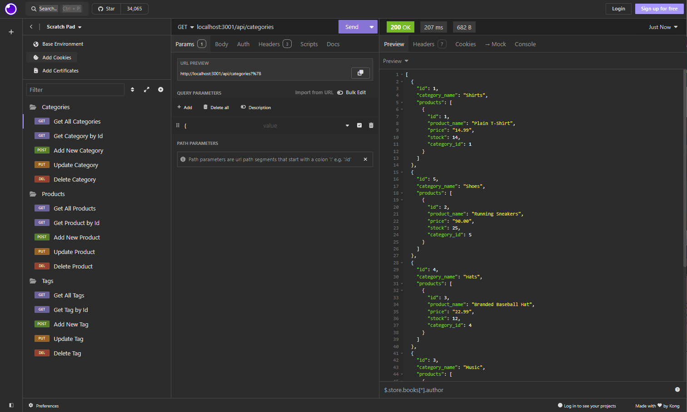

# Efficient ECommerce
A Back-End application that makes maintaining an E-Commerce database as Efficient as possible.
## Description
Efficient ECommerce is a useful tool that allows the user to view all of the Products, Categories and Tags inside of a Postgres Database. Not only can the user view all of the information in these three tables, it provides the functionality to do Much More! Users can add new Products, Categories and Tags to the database. Updating the values in these three table is also very easy using Efficient ECommerce. Lastly, if the user finds that he/she needs to Delete a Product, Category or Tag, the Efficient ECommerce application allows for that as well.
 

 
Click <a href="https://drive.google.com/file/d/1K_jXpI39qLctbhLen03-dyzVzCjrWZit/view" target="_blank">here</a> to view the walk-through video of Efficient ECommerce.

 
## Table of Contents
1. [Installation](#installation)
2. [Usage](#usage)
3. [License](#license)
4. [Contributing](#contributing)
5. [Tests](#tests)
6. [Questions](#questions)
7. [Acknowledgements](#acknowledgements)

## Installation
npm install
npm run seed

## Usage
This repository is Public and can be used by anyone.

## License
This project is not currently licensed.

## Contributing
Please email me with any comments and suggestions about Efficient ECommerce.

## Tests
npm run test

## Questions
If you have any questions about this Project or its Repository, I can be reached at <a href=mailto:brabur@yahoo.com>brabur@yahoo.com</a>.  You can also find more of my work at <a href="https://github.com/BradBurr-Github" target="_blank">BradBurr-Github</a>.

## Acknowledgements
None at this time.